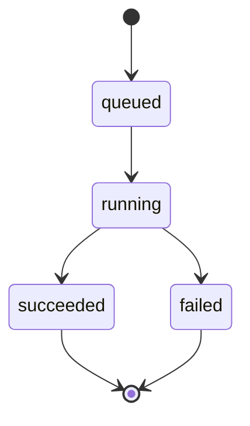

# Job Lifecycle Semantics (v1.0)

## Overview
This document defines the deterministic state machine for jobs within the OPAL pipeline. All client and server implementations MUST strictly adhere to these states and transitions.

## States
| State | Description | Terminal? |
|-------|-------------|-----------|
| `queued` | Job has been accepted and is waiting for an available worker. | No |
| `running` | Job is currently being processed by the worker. | No |
| `succeeded` | Job completed successfully. Artifacts are available in `outputs`. | Yes |
| `failed` | Job stopped due to an error. Details are in the `message` field. | Yes |

## Transitions

## Polling Strategy
- **Interval**: Recommended 2s.
- **Backoff**: If server returns 429 or 5xx, use exponential backoff (max 30s).
- **Timeout**: Default 600s (10 minutes) unless specified in metadata.
