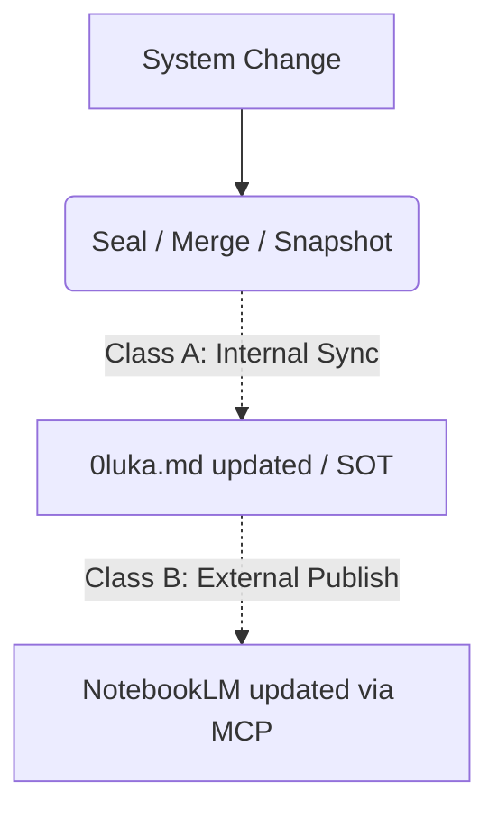

# Design Spec: Stateful SOT Synchronization & External Publish (NotebookLM)

## Context

Integration with NotebookLM MCP needs a strictly governed pipeline. We cannot allow internal raw file changes (e.g., via `fs_watcher`) to automatically push unverified drafts to an external LLM context without an explicit, auditable gate.

## Workflow Concept

## State Definitions

The system's Single Source of Truth document (`0luka.md`) and related context bundles will now track an explicit state:

1. **`STATE: DRAFT`**: Working tree is dirty, unverified changes exist, or tests are failing.
2. **`STATE: SEALED`**: Commit created, PR successfully merged, snapshot generated, and governance rings verified.
3. **`STATE: PUBLISHED`**: The tightly sealed state has been explicitly pushed to the external MCP (NotebookLM) and acknowledged.

---

## 2-Tier Trigger System

### 🔄 Class A — Internal Sync (Auto-Sync)

**Goal:** Maintain internal repository consistency without leaking unverified data externally.
**Triggers:** Fast-forward merges, `git commit` hooks, or scheduled local daemons (e.g., `fs_watcher` triggering a digest rebuild).
**Actions:**

- Regenerate the comprehensive SOT document (`0luka.md`).
- Update system snapshots (`observability/artifacts/snapshots/`).
- Update the tool/skill catalog (`catalog_lookup.zsh` index).
**Strict Rule:** Internal sync processes are strictly confined to the local filesystem. They must **never** trigger a Class B publish.

### 🚀 Class B — External Publish (Explicit)

**Goal:** Safely and deliberately update the external NotebookLM context.
**Triggers:** Only explicit execution by a Sovereign Agent or Human Operator.
**Execution Gate (Must satisfy at least ONE):**

1. The `--publish` flag is explicitly passed to the SOT build command.
2. A formal `STATE: SEALED` marker is present in the document metadata (via successful CI or merged PR).
3. The payload passes a formal `auto_governor_router` check ensuring no unauthorized kernel mutations occurred.
**Actions:**

- Invoke the NotebookLM MCP client.
- Replace the stale documentation in the remote notebook with the newly sealed `0luka.md` (+ digests).
- Mark local telemetry as `PUBLISHED`.

---

## Anti-Patterns (Forbidden)

❌ **NO Trivial Propagation:**
`fs_watcher` detects file change → auto updates `0luka.md` → auto pushes to NotebookLM.
*(Reason: Floods NotebookLM with broken compilation states, trashing the external AI context.)*

❌ **NO Unverified Context:**
Pushing `STATE: DRAFT` documents to NotebookLM.
*(Reason: Breaks the "Internal truth auto-sync, External truth explicit publish" paradigm.)*

---

## Proposed Implementation Footprint

To materialize this design, the following minimal changes to the `0luka` repo would be required:

1. **`tools/sync_sot.py` (or zsh equivalent)**:
   - Responsible for Class A (Internal Sync).
   - Injects `STATE: DRAFT` or `STATE: SEALED` into the header of `0luka.md` based on Git status.

2. **`tools/publish_notebooklm.py` (The Class B Gate)**:
   - Responsible for Class B (External Publish).
   - Reads `0luka.md`. If `STATE: DRAFT` and `--publish` isn't forced, it aborts.
   - Executes standard NotebookLM MCP tools to upload the SOT.

3. **Status Header in `0luka.md`**:
   - `Title: 0luka Main System Protocol`
   - `Status: STATE: SEALED`
   - `Last Sync: <UTC timestamp>`
