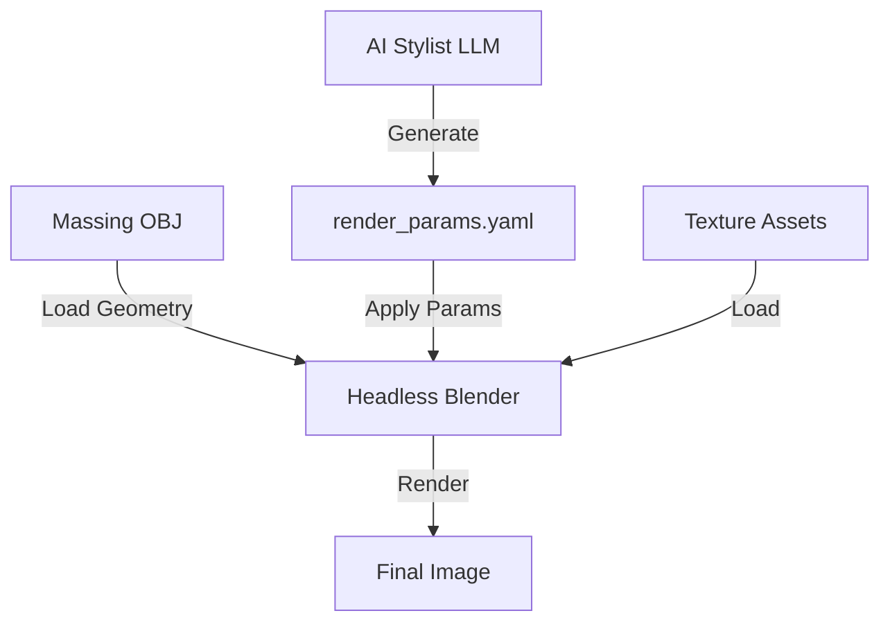

# Phase 3.1 Specification: Parameter-Driven Rendering (Touchless)

## 1. Philosophy
**"Geometry is Law. AI is Decor."**
This phase implements a deterministic rendering pipeline where:
- **Geometry** is strictly loaded from `massing_v1.obj` (AEC Lane).
- **AI** only provides *parameters* (Material selection, Lighting presets) via JSON/YAML.
- **Renderer** (Blender/Cycles) executes blindly without hallucinating new shapes.

## 2. Architecture



## 3. The Slots System (Contract)
The geometry exports 3 main groups:
1.  **g Floor**: The floor plane.
2.  **g Ceiling**: The ceiling plane (often hidden or emissive).
3.  **g Wall**: Vertical partitions.

The `render_slots.yaml` defines what materials are legal for these groups.

## 4. Automation Workflow
1.  `massing_engine.py` generates `massing_v1.obj` (with group tags).
2.  `distiller_v2.py` (New) generates `render_params.yaml` based on user prompt (e.g. "Japandi").
3.  `apply_params.py` (Blender) runs:
    ```bash
    blender -b resources/studio_base.blend --python apply_params.py -- --obj massing_v1.obj --params render_params.yaml
    ```
4.  Result copied to Google Drive.

## 5. Next Implementation Steps
1.  Verify `massing_v1.obj` has correct `g` tags.
2.  Mock `render_params.yaml`.
3.  Implement `apply_params.py`.
